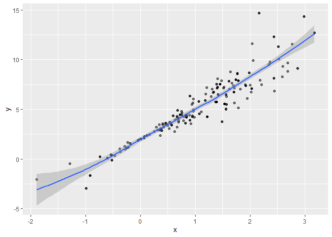

linear_models
================
Yuxuan Wang
2023-11-11

``` r
library(tidyverse)
```

    ## ── Attaching core tidyverse packages ──────────────────────── tidyverse 2.0.0 ──
    ## ✔ dplyr     1.1.3     ✔ readr     2.1.4
    ## ✔ forcats   1.0.0     ✔ stringr   1.5.0
    ## ✔ ggplot2   3.4.3     ✔ tibble    3.2.1
    ## ✔ lubridate 1.9.3     ✔ tidyr     1.3.0
    ## ✔ purrr     1.0.2     
    ## ── Conflicts ────────────────────────────────────────── tidyverse_conflicts() ──
    ## ✖ dplyr::filter() masks stats::filter()
    ## ✖ dplyr::lag()    masks stats::lag()
    ## ℹ Use the conflicted package (<http://conflicted.r-lib.org/>) to force all conflicts to become errors

``` r
library(p8105.datasets)

set.seed(1)
```

# Generate a relevant example

``` r
n_samp = 250

sim_df_const = 
  tibble(
    x = rnorm(n_samp, 1, 1),
    error = rnorm(n_samp, 0, 1),
    y = 2 + 3 * x + error
  )

sim_df_nonconst = sim_df_const |> 
  mutate(
  error = error * .75 * x,
  y = 2 + 3 * x + error
)
```

``` r
sim_df = 
  bind_rows(const = sim_df_const, nonconst = sim_df_nonconst, .id = "data_source") 

sim_df |> 
  ggplot(aes(x = x, y = y)) + 
  geom_point(alpha = .5) +
  stat_smooth(method = "lm") +
  facet_grid(~data_source) 
```

    ## `geom_smooth()` using formula = 'y ~ x'

<!-- -->

``` r
lm(y ~ x, data = sim_df_const) |> 
  broom::tidy() |> 
  knitr::kable(digits = 3)
```

| term        | estimate | std.error | statistic | p.value |
|:------------|---------:|----------:|----------:|--------:|
| (Intercept) |    1.977 |     0.098 |    20.157 |       0 |
| x           |    3.045 |     0.070 |    43.537 |       0 |

``` r
sim_df_nonconst |> 
  lm(y ~ x, data = _) |> 
  broom::tidy() |> 
  knitr::kable(digits = 3)
```

| term        | estimate | std.error | statistic | p.value |
|:------------|---------:|----------:|----------:|--------:|
| (Intercept) |    1.934 |     0.105 |    18.456 |       0 |
| x           |    3.112 |     0.075 |    41.661 |       0 |

# Drawing one bootstrap sample

Start with a little function

``` r
boot_sample = function(df){
  
  sample_frac(df, replace = TRUE)
}
```

Let’s see how it works

``` r
sim_df_nonconst |> 
  boot_sample() |> 
  ggplot(aes(x = x, y = y)) +
  geom_point(alpha = .5) +
  stat_smooth(menthos = "lm")
```

    ## Warning in stat_smooth(menthos = "lm"): Ignoring unknown parameters: `menthos`

    ## `geom_smooth()` using method = 'loess' and formula = 'y ~ x'

<!-- -->

``` r
n_samp = 250

sim_df_const = 
  tibble(
    x = rnorm(n_samp, 1, 1),
    error = rnorm(n_samp, 0, 1),
    y = 2 + 3 * x + error
  )

sim_df_nonconst = sim_df_const |> 
  mutate(
  error = error * .75 * x,
  y = 2 + 3 * x + error
)
```
